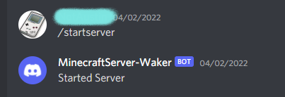

# EC2WakeBot  
Discord bot that will interact with an AWS EC2 instance based on discord commands.
  
This discord bot is written in python using discord.py and boto3, both can be downloaded from pip.  
For this to work, you can either run the bot from your own server, or run it on a different EC2 instance in AWS.  
The intention is that you have a cloudwatch alert set on your instance, stopping your instance if the CPU usage drops below a certain amount.
The original intent was to use with a Minecraft server, running on that EC2.    
These are two possible configurations.  
  
  
  
## Commands  
The current commands are...  
* startserver
* checkserver
  
These commands will start the instance and check the instance status respectively.  
  
 
  
You will want to ensure the machine running the bot has the latest version of python installed.  
To start the bot, run py bot.py  
  
This is very basic, but could be expanded upon.